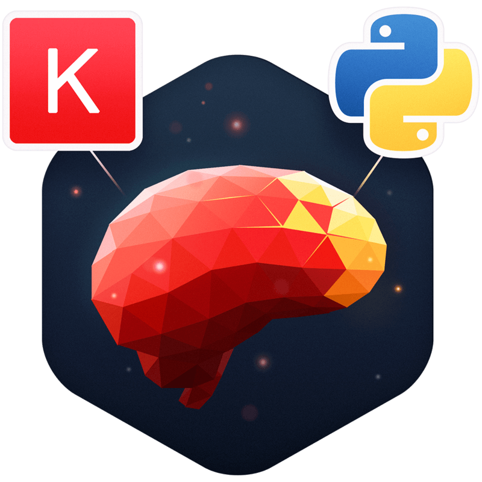

# GPU_Python_Programming_with_MacBook

This repo has a single notebook on how to install Keras with AMD / plaidML backend in order to do some Python programming with AMD GPU accelerator on a MacBook.

Enjoy!

